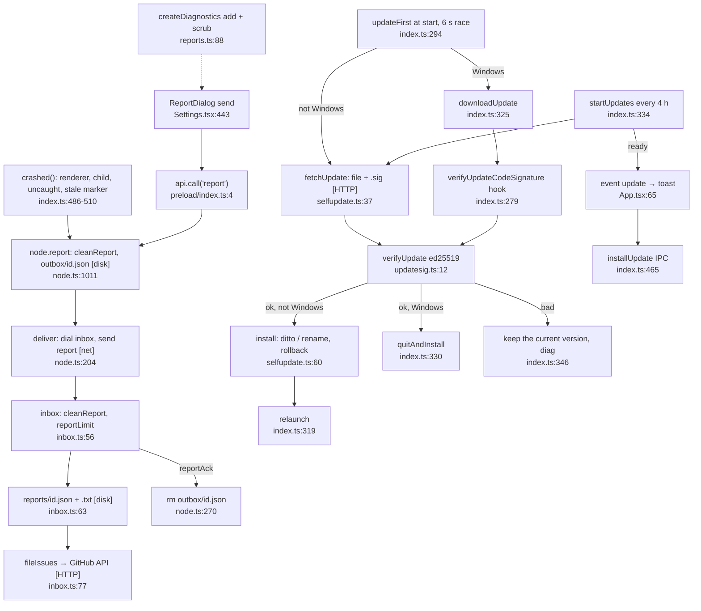

# 6. Reports, updates and app shell

```mermaid
flowchart TD
  R0["ReportDialog send<br/>Settings.tsx:443"] --> R1["api.call('report')<br/>preload/index.ts:4"]
  C0["crashed(): renderer, child, uncaught, stale marker<br/>index.ts:486-510"] --> R2
  R1 --> R2["node.report: cleanReport, outbox/id.json [disk]<br/>node.ts:1011"]
  D0["createDiagnostics add + scrub<br/>reports.ts:88"] -.-> R0
  R2 --> R3["deliver: dial inbox, send report [net]<br/>node.ts:204"]
  R3 --> I0["inbox: cleanReport, reportLimit<br/>inbox.ts:56"]
  I0 --> I1["reports/id.json + .txt [disk]<br/>inbox.ts:63"]
  I1 --> I2["fileIssues → GitHub API [HTTP]<br/>inbox.ts:77"]
  I0 -->|reportAck| R4["rm outbox/id.json<br/>node.ts:270"]
  U0["updateFirst at start, 6 s race<br/>index.ts:294"] -->|not Windows| U1["fetchUpdate: file + .sig [HTTP]<br/>selfupdate.ts:37"]
  U0 -->|Windows| U2["downloadUpdate<br/>index.ts:325"] --> U3["verifyUpdateCodeSignature hook<br/>index.ts:279"]
  U1 --> V["verifyUpdate ed25519<br/>updatesig.ts:12"]
  U3 --> V
  V -->|ok, not Windows| U4["install: ditto / rename, rollback<br/>selfupdate.ts:60"] --> U6["relaunch<br/>index.ts:319"]
  V -->|ok, Windows| U5["quitAndInstall<br/>index.ts:330"]
  V -->|bad| X["keep the current version, diag<br/>index.ts:346"]
  S0["startUpdates every 4 h<br/>index.ts:334"] --> U1
  S0 -->|ready| S1["event update → toast<br/>App.tsx:65"] --> S2["installUpdate IPC<br/>index.ts:465"]
```

**Depends on:** transport (dialing the inbox key), the IPC bridge (index.ts:513: only `Object.hasOwn(node, method)`).
