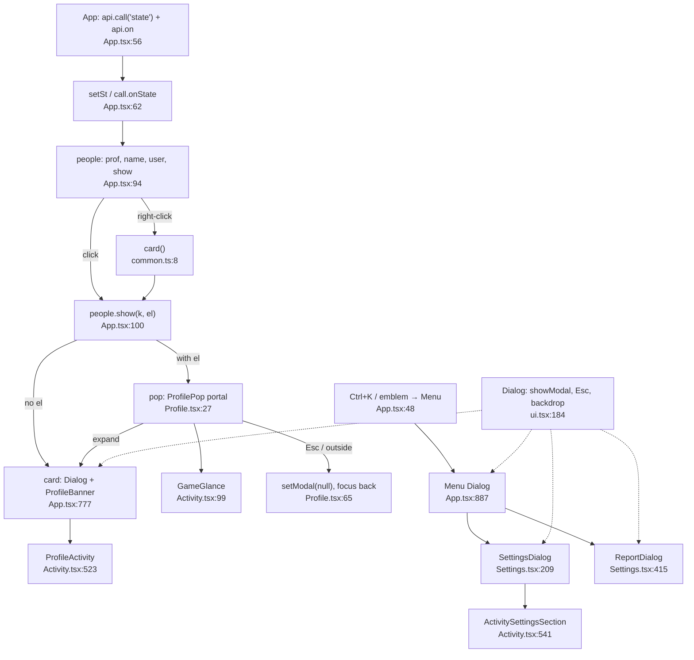

# 7. UI shell

```mermaid
flowchart TD
  P0["App: api.call('state') + api.on<br/>App.tsx:56"] --> P1["setSt / call.onState<br/>App.tsx:62"]
  P1 --> P2["people: prof, name, user, show<br/>App.tsx:94"]
  P2 -->|click| P3["people.show(k, el)<br/>App.tsx:100"]
  P2 -->|right-click| P4["card()<br/>common.ts:8"] --> P3
  P3 -->|with el| P5["pop: ProfilePop portal<br/>Profile.tsx:27"]
  P3 -->|no el| P6["card: Dialog + ProfileBanner<br/>App.tsx:777"]
  P5 --> P7["GameGlance<br/>Activity.tsx:99"]
  P6 --> P8["ProfileActivity<br/>Activity.tsx:523"]
  P5 -->|expand| P6
  P5 -->|Esc / outside| P9["setModal(null), focus back<br/>Profile.tsx:65"]
  K["Ctrl+K / emblem → Menu<br/>App.tsx:48"] --> M0["Menu Dialog<br/>App.tsx:887"]
  M0 --> SD["SettingsDialog<br/>Settings.tsx:209"]
  M0 --> RD["ReportDialog<br/>Settings.tsx:415"]
  SD --> AS["ActivitySettingsSection<br/>Activity.tsx:541"]
  DLG["Dialog: showModal, Esc, backdrop<br/>ui.tsx:184"] -.-> P6 & M0 & SD & RD
```

**Depends on:** every other feature, through the IPC bridge and pushed state.

**Gaps:** App.tsx (1163 lines) and Settings.tsx were only partly read.
